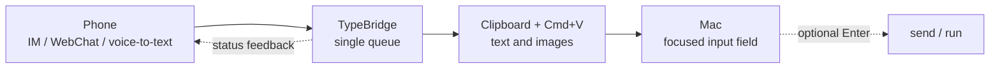

<p align="center">
  
</p>

<h1 align="center">TypeBridge</h1>
<p align="center"><strong>Speak on your phone. Type on your Mac.</strong></p>

<p align="center">
  <a href="https://typebridge.parksben.xyz"><strong>Website</strong></a>
  &nbsp;·&nbsp;
  <a href="https://typebridge.parksben.xyz/#download"><strong>Download</strong></a>
  &nbsp;·&nbsp;
  <a href="README.md">中文</a>
</p>

<p align="center"><strong>Type on your phone. Paste on your Mac. TypeBridge is the bridge in between.</strong></p>



---

## 👋 What is TypeBridge?

TypeBridge is a macOS menu bar app that sends text from your phone to the place where your Mac cursor is already waiting.

You can send a message through a Feishu, DingTalk, or WeCom bot, or use the built-in WebChat page on your local network. TypeBridge receives it, puts it into one local queue, then pastes it into the focused app with the system clipboard and `Cmd+V`.

## 🧩 Why does this exist?

Phones are often better input devices than we admit. Voice-to-text is fast, and short notes are easy to capture. The annoying part is moving that text back to your desktop without breaking focus.

TypeBridge keeps the handoff small: **speak or type on your phone, and the text lands where you are working on your Mac.**

## ✨ Highlights

| Feature | |
|---|---|
| **Four inputs, one queue** | Feishu, DingTalk, WeCom, and WebChat all feed into the same FIFO queue, so messages are handled one at a time. |
| **Works by pasting** | TypeBridge writes to the clipboard and simulates `Cmd+V`, which keeps it compatible with common macOS apps such as VS Code, Terminal, browsers, Obsidian, and Slack. |
| **Optional auto-submit** | After pasting, TypeBridge can press `Enter` or a custom key. Handy for chat windows, terminals, and AI assistants. |
| **Image support** | Images from IM channels are injected through the clipboard as well. |
| **Built-in WebChat** | No bot setup needed. Start a local WebChat session, scan the QR code, enter the OTP, and type from your phone. |
| **Local-first when possible** | WebChat traffic stays on your LAN and does not depend on a cloud relay. |

## 🔄 How it works

1. Connect a channel: WebChat, Feishu, DingTalk, or WeCom.
2. Send text, voice-to-text, or an image from your phone.
3. TypeBridge receives the message and appends it to the local queue.
4. When the message is next, TypeBridge writes it to the clipboard and sends `Cmd+V`.
5. If auto-submit is enabled, it sends `Enter` or your configured key afterwards.

## 📡 Supported channels

| Channel | What you need | Best for |
|---|---|---|
| **WebChat** | No account. Start a session and scan the QR code. | Personal use, quick trials, offline workflows |
| **Feishu** | Self-built app (App ID + Secret) | Teams already using Feishu |
| **DingTalk** | Internal app (Client ID + Secret, Stream Mode) | Teams already using DingTalk |
| **WeCom** | Smart Bot (Bot ID + Secret) | Teams already using WeCom |

## 🖥️ System requirements

macOS 13+ (Apple Silicon or Intel)

On first launch, TypeBridge asks for **Accessibility** permission. It is used to send `Cmd+V` and optional submit keys to the frontmost app; TypeBridge does not read or monitor your screen.

## 🛠️ Development

### Prerequisites

| Dependency | Version |
|---|---|
| Node.js | 20+ |
| Rust | stable (1.95+) |
| Go | 1.21+ |
| Xcode Command Line Tools | required |

### Quick Start

```bash
npm install

# Build Go sidecars (aarch64)
for bridge in feishu-bridge dingtalk-bridge wecom-bridge; do
  (cd "$bridge" && GOPROXY=https://goproxy.cn,direct GOOS=darwin GOARCH=arm64 \
    go build -o "../src-tauri/binaries/${bridge}-aarch64-apple-darwin" .)
done

# Start dev mode
npm run tauri dev
```

### Project Layout

```
type-bridge/
├── src/                     React frontend (Vite + Tailwind + Zustand)
├── src-tauri/               Tauri / Rust backend
│   └── src/
│       ├── injector.rs      Text injection via CGEventPost + NSPasteboard
│       ├── sidecar.rs       Go sidecar process management
│       ├── webchat.rs       Built-in LAN WebChat server host
│       ├── queue.rs         FIFO injection queue + feedback
│       └── ...
├── feishu-bridge/           Feishu Go sidecar (long-connection WebSocket)
├── dingtalk-bridge/         DingTalk Go sidecar (Stream Mode)
├── wecom-bridge/            WeCom Go sidecar (WSS + AES image decrypt)
├── website/                 Product site (Next.js, single-page landing)
├── webchat-local/           WebChat mobile SPA (Vite + React + TS)
└── docs/
    ├── REQUIREMENTS.md      Product spec (what & why)
    └── TECH_DESIGN.md       Architecture & technical decisions (how)
```

### Development notes

- **Go sidecars require manual rebuild** — `tauri dev` does not recompile Go. After editing `.go` files, run `go build` for the affected bridge, then restart `tauri dev`.
- **Frontend HMR** works automatically for `src/` changes.
- **Rust changes** are picked up automatically by `tauri dev` (cargo rebuild).
- For full development workflow, architecture details, and inter-process event contracts, see [CLAUDE.md](CLAUDE.md).

### Build & Package

```bash
# Single arch
npm run tauri build -- --target aarch64-apple-darwin

# Both archs
./scripts/build-all.sh
```

Output: `src-tauri/target/{arch}/release/bundle/dmg/TypeBridge_*.dmg`

### CI/CD

Push a `v*` tag or trigger the `Release` workflow manually via GitHub Actions. See [docs/REQUIREMENTS.md](docs/REQUIREMENTS.md) and [docs/TECH_DESIGN.md](docs/TECH_DESIGN.md).

## 📄 License

[MIT](LICENSE)
