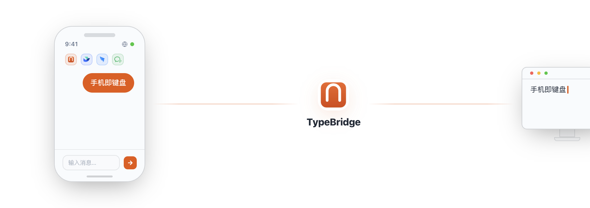

<div align="center">
  
<h1>TypeBridge</h1>
<p><strong>手机即键鼠</strong></p>
</div>

<p align="center">
  <a href="https://typebridge.parksben.xyz"><strong>官网</strong></a>
  &nbsp;·&nbsp;
  <a href="https://typebridge.parksben.xyz/#download"><strong>下载</strong></a>
  &nbsp;·&nbsp;
  <a href="README.md">English</a>
</p>

<p align="center">
  
</p>

---

## 👋 TypeBridge 是什么？

TypeBridge 是一款 macOS 菜单栏应用。打开 App、扫个码，手机立刻变成 Mac 的无线键盘和触控板——打字、控鼠标、语音输入，一部手机全搞定。

你也可以通过飞书、钉钉、企业微信机器人发送消息，消息会自动注入桌面当前聚焦的输入框。

## 🧩 它解决什么问题？

演示 PPT 时站在远处想遥控电脑？躺沙发刷网页不想起身？用 AI 写代码、写文档时在手机和电脑之间来回传文字？

TypeBridge 做的事很简单：**把手机变成 Mac 的无线键盘和触控板**。打字、控制光标、语音输入，一条扫码的事儿。

## ✨ 主要能力

| 能力 | |
|---|---|
| **触控板模式** | 单指移动光标，双指滚动页面，点按左键右键。不用蓝牙、不用配对，扫码就能用。 |
| **文字输入** | 手机上打字，电脑上出字。光标在哪，字就落在哪。支持微信/飞书/钉钉/企微输入法的语音转文字。 |
| **快捷指令** | 一键发送方向键、Cmd+Z/X/C/V、Enter、Escape 等常用快捷键，省去够键盘的麻烦。 |
| **内置 WebChat** | 不想配 IM 机器人时，启动局域网 WebChat，手机扫码输入 OTP 即连。不走云端，消息只在同一局域网流转。 |
| **IM 机器人接入** | 飞书、钉钉、企业微信三个渠道，发消息自动注入当前聚焦输入框。多条消息按 FIFO 顺序处理，不会抢焦点打架。 |
| **通用粘贴策略** | 通过剪贴板 + `Cmd+V` 注入，VS Code、Terminal、浏览器、Obsidian、Slack 等常见应用都能用。 |
| **图片也能传** | IM 里发来的图片写入系统剪贴板，再粘贴到目标应用。 |
| **可选自动提交** | 粘贴后可以自动按 `Enter`，也可以换成你自己的提交按键。适合聊天、终端、AI 对话框。 |
| **应用更新更顺滑** | 关于页顶部内嵌更新状态栏，实时显示下载进度，支持取消与失败后重试，不阻塞继续使用。 |

## 🔄 使用方式

1. 在桌面端启动 TypeBridge，启动 WebChat 会话。
2. 手机扫码、输入 OTP，进入打字或触控板模式。
3. 打字 / 语音 / 控制光标，桌面端即时响应。
4. 如果开启了自动提交，粘贴后自动补 `Enter` 或自定义按键。
5. 也可以用飞书、钉钉、企微机器人发消息，消息写入同一 FIFO 队列串行注入。

## 📡 支持渠道

| 渠道 | 需要什么 | 适用场景 |
|---|---|---|
| **WebChat** | 无需账号。启动会话，扫码即连。 | 个人使用、快速试用、离线场景 |
| **飞书** | 自建应用（App ID + Secret） | 已在用飞书的团队 |
| **钉钉** | 企业内部应用（Client ID + Secret，Stream 模式） | 已在用钉钉的团队 |
| **企业微信** | 智能机器人（Bot ID + Secret） | 已在用企业微信的团队 |

## 🖥️ 系统要求

macOS 13+（Apple Silicon 或 Intel）

首次启动会申请**辅助功能**权限。它只用于向前台应用发送 `Cmd+V` 和提交按键；TypeBridge 不会读取或监控屏幕内容。

## 🛠️ 开发

### 环境要求

| 依赖 | 版本 |
|---|---|
| Node.js | 20+ |
| Rust | stable (1.75+) |
| Go | 1.21+ |
| Xcode Command Line Tools | 必须安装 |

> 📖 **首次搭建**请阅读 [docs/DEV_SETUP.md](docs/DEV_SETUP.md)，包含完整的环境初始化步骤、常见报错解法和镜像配置。

### 快速开始

```bash
# 1. 安装 npm 依赖（根目录 + webchat-local 子项目）
npm install && cd webchat-local && npm install && cd ..

# 2. 编译 Go sidecar（三个渠道，aarch64）
mkdir -p src-tauri/binaries
for bridge in feishu-bridge dingtalk-bridge wecom-bridge; do
  (cd "$bridge" && GOPROXY=https://goproxy.cn,direct GOOS=darwin GOARCH=arm64 \
    go build -ldflags '-s -w' \
      -o "../src-tauri/binaries/${bridge}-aarch64-apple-darwin" .)
done

# 3. 构建 webchat-local 静态资源（tauri dev 不会自动触发）
cd webchat-local && npm run build && cd ..

# 4. 启动开发模式（首次约 5-10 分钟冷编译，之后秒级增量）
npm run tauri dev
```

### 项目结构

```
type-bridge/
├── src/                     前端（Vite + Tailwind + Zustand）
├── src-tauri/               Tauri / Rust 后端
│   └── src/
│       ├── injector.rs      文本注入（CGEventPost + NSPasteboard）
│       ├── sidecar.rs       Go sidecar 进程管理
│       ├── webchat.rs       内置局域网 WebChat 服务宿主
│       ├── queue.rs         FIFO 注入队列 + 反馈
│       └── ...
├── feishu-bridge/           飞书 Go sidecar（长连接 WebSocket）
├── dingtalk-bridge/         钉钉 Go sidecar（Stream 模式）
├── wecom-bridge/            企业微信 Go sidecar（WSS + AES 图片解密）
├── website/                 官网（Next.js，单页落地页）
├── webchat-local/           WebChat 手机端 SPA（Vite + React + TS）
```

### 开发时注意

- **Go sidecar 需手动重新编译** — `tauri dev` 不会自动编译 Go。修改 `.go` 文件后需手动 `go build` 对应 bridge，然后重启 `tauri dev`。
- **webchat-local 需手动重新构建** — `tauri dev` 不会触发 `webchat-local` 的 Vite 构建。修改 `webchat-local/` 源码后需手动 `cd webchat-local && npm run build`。
- **前端 HMR** 对 `src/` 的修改自动生效。
- **Rust 修改** 会被 `tauri dev` 自动检测（cargo 增量编译）。

### 构建与打包

```bash
# 单架构
npm run tauri build -- --target aarch64-apple-darwin

# 双架构
./scripts/build-all.sh
```

产物：`src-tauri/target/{arch}/release/bundle/dmg/TypeBridge_*.dmg`

## 📄 许可证

[MIT](LICENSE)
