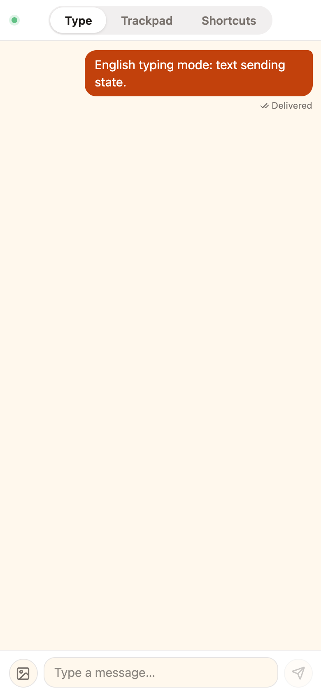
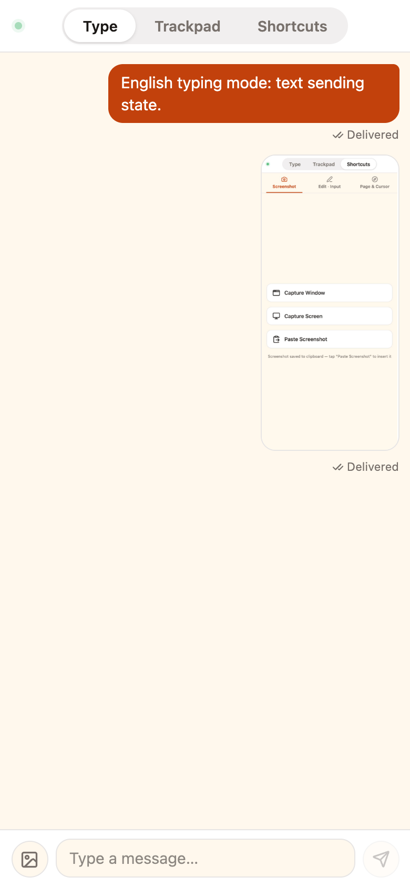
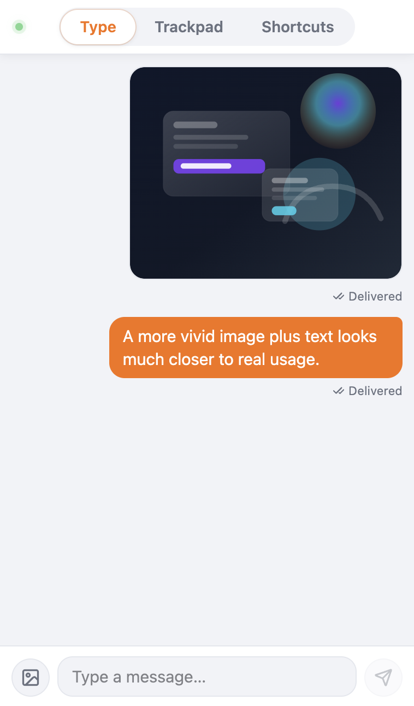
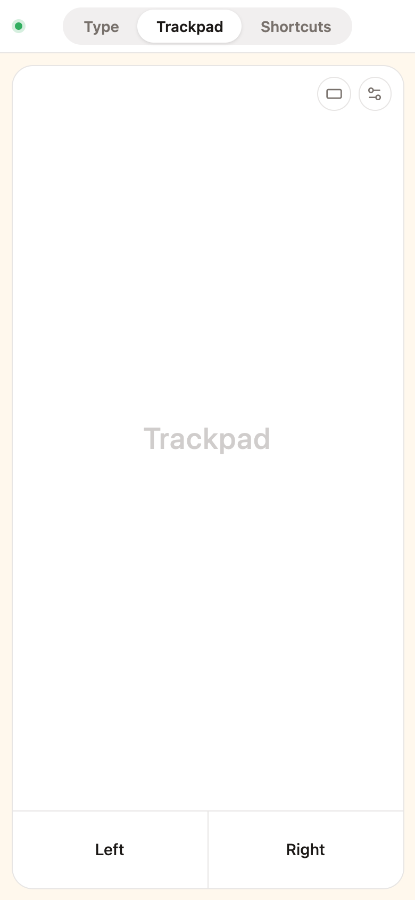
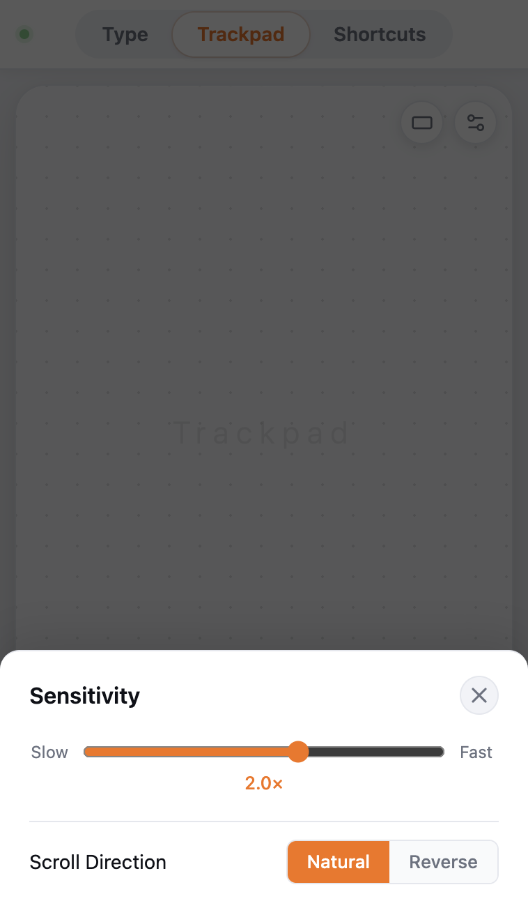
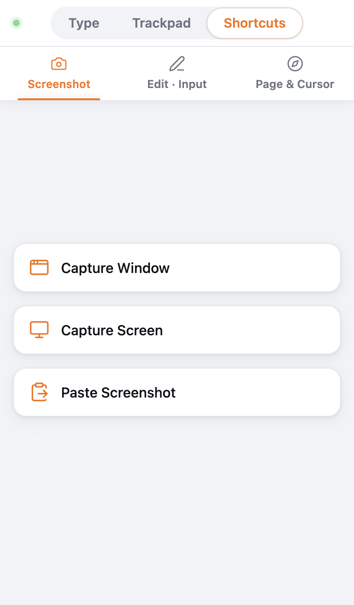
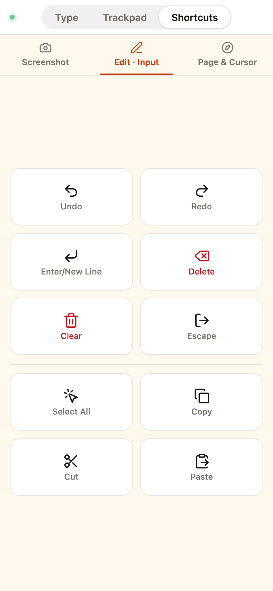
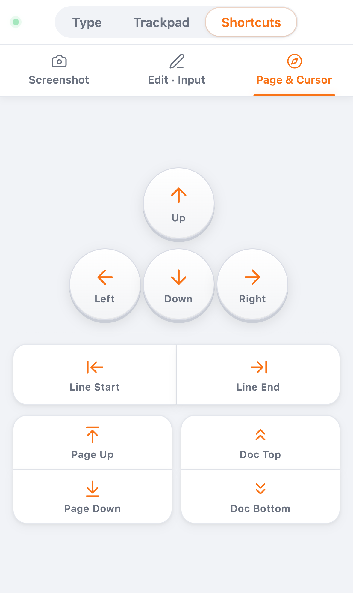

# One Phone. Your Next Keyboard & Mouse.

> Open the app. Scan a code. Your phone just became a wireless keyboard and trackpad for your Mac.

Website: [typebridge.parksben.xyz](https://typebridge.parksben.xyz) · GitHub: [parksben/type-bridge](https://github.com/parksben/type-bridge)

---

Ever been here?

You're presenting slides from across the room. You want to skip ahead, but the laptop is ten feet away. You're on the couch, wanting to look something up, but the keyboard is out of arm's reach. You're coding with an AI assistant, copying text back and forth between your phone and desktop until your fingers hurt.

TypeBridge was built for these moments.

---

## What Is TypeBridge?

TypeBridge is a macOS desktop app. In one sentence: **it turns your iPhone or Android phone into a wireless keyboard, trackpad, and voice input device for your Mac.**

No Bluetooth pairing. No shared Apple ID. No cable. Just open the app, scan a QR code with your phone, and you're connected.

*▲ Desktop main window. Scan with your phone to control your Mac.*

Type on your phone — the text lands wherever your Mac cursor is. Use your phone screen as a trackpad — one finger moves, two fingers scroll. And the best part: tap the microphone on your phone's keyboard, speak, and your words appear on the Mac.

---

## Three Modes, One Phone

### Type Mode

Type on your phone, hit send, and the text lands wherever your Mac cursor is. VS Code, Terminal, the browser address bar, Slack — if the cursor blinks there, the words go there.

Type Mode works seamlessly with voice input: open your phone's built-in keyboard, tap the mic, speak, then hit send. The words appear at the Mac cursor. **No extra speech-to-text engine needed.** Mandarin Chinese comfortably hits 200+ characters per minute — about twice as fast as most people type.

	
	
	

*▲ Text, images, or both — they all land on your Mac. Type, hit send, done.*

> A verification code shows up on your phone. Instead of reading it aloud and typing it in — tap send. It fills itself. Writing a weekly report? Just talk through it. Watch the lines appear in Notion.

### Trackpad Mode

Your phone screen turns into a Mac trackpad. One finger moves the cursor, two fingers scroll, tap to click, two-finger tap to right-click.

	
	

*▲ Left: the trackpad in action. Right: the settings panel.*

> Presenting slides from the front of the room — your phone is in your hand, advancing slides and moving the cursor. No need to walk back. Browsing YouTube from the couch? The phone is your remote.

### Shortcut Mode

The third tab is a shortcut panel. Screenshot, undo, select all, copy, paste, arrow keys, page navigation — the commands you reach for every day, one tap away. They execute directly on your Mac. Keyboard stays untouched.

	
	
	

*▲ Screenshot, Edit & Input, Page & Cursor — shortcuts for all kinds of tasks. What takes a key combo on your keyboard is a single tap here.*

> Briefing an AI assistant — describe the task aloud, hit send, and Cursor receives it. Reviewing a document? Scroll with one hand, keep your coffee in the other.

Same WiFi. End to end on your local network. Your words never leave the room.

---

## IM Bot Support, Too

Use Feishu, DingTalk, or WeCom? TypeBridge connects to their bots.

Set up a self-built app on the desktop side. Send a message to the bot, and it drops into the active input field on your Mac. Multiple messages queue up and process in order — no conflicts.

> Team use case: @mention the bot in a group chat with a paragraph. The doc on the conference room screen updates in sync.

---

## Getting Started

1. Download the macOS app from [typebridge.parksben.xyz](https://typebridge.parksben.xyz)
2. Grant Accessibility permission on first launch (one-time)
3. Start a WebChat session, scan the QR code with your phone
4. Pick typing, trackpad, or voice mode — and go

Completely free. No account needed. No internet required — WebChat works entirely over your home WiFi.

---

## Wrapping Up

TypeBridge does one thing: **it removes the wall between your phone and your Mac.**

It's not here to replace your keyboard or trackpad. It's here for when you're leaning back, on the couch, or at the front of the room — and your phone is the closest thing at hand.

One phone. Your next keyboard and mouse.

---

[Download TypeBridge](https://typebridge.parksben.xyz/#download) · [GitHub](https://github.com/parksben/type-bridge)
