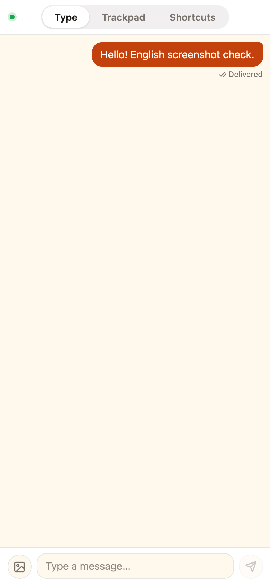
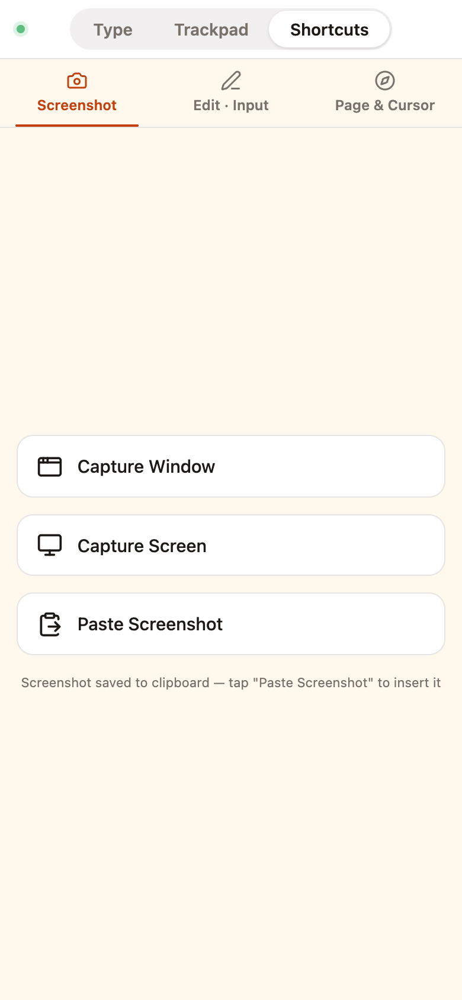

# One Phone. Your Next Keyboard & Mouse.

> Open the app. Scan a code. Your phone just became a wireless keyboard and trackpad for your Mac.

---

You know the feeling—

Presenting slides from across the room and needing to skip forward. Lounging on the couch, wanting to search something, but the keyboard is out of reach. Coding with an AI assistant, juggling text between your phone and desktop, copying and pasting until your fingers ache.

**TypeBridge fixes this.**

---

## What Is TypeBridge?

TypeBridge is a macOS desktop app. One sentence: **it turns your iPhone or Android phone into a wireless keyboard, trackpad, and voice input device for your Mac.**

No Bluetooth pairing. No shared Apple ID. Not even a cable. Open the app, scan a QR code with your phone, and you are connected.

*▲ Fig.1 | TypeBridge desktop main window (WebChat connection tab, scan to connect your phone)*

Type on your phone — text lands at your Mac's cursor. Use your phone screen as a trackpad — one finger moves, two fingers scroll. Best of all: tap the microphone on your phone's keyboard, speak, and your words appear on your Mac.

---

## Three Modes, One Phone

### Type Mode

Type on your phone, hit send, and the text lands wherever your Mac cursor is. VS Code, Terminal, the browser address bar, Slack — if the cursor is there, that is where the words go.

Type Mode also works naturally with voice input: open your phone's built-in keyboard, tap the mic, speak, then hit send — your words appear right at the Mac cursor. **No extra speech-to-text engine required.** Mandarin Chinese comfortably hits 200+ characters per minute — roughly twice as fast as most people type.

> Real-world moment: a verification code arrives on your phone. Instead of reading it out loud and typing it in — tap send. The field fills itself. Writing a weekly report? Think out loud, sentence by sentence, and watch the lines appear in Notion.

### Trackpad Mode

Your phone screen becomes a Mac trackpad. One finger moves the cursor, two fingers scroll, tap to click, two-finger tap to right-click.

> Real-world moment: you are presenting slides from the front of the room. Your phone is in your hand — advance slides, move the cursor, no need to walk back to the laptop. Browsing YouTube from the couch? Your phone is the remote.

### Shortcut Mode

The third tab is a shortcut panel. Screenshot, undo, select all, copy, paste, arrow keys, page navigation — all the commands you reach for every day, one tap away, executed directly on your Mac without touching the keyboard.

> Real-world moment: briefing an AI assistant — describe the task verbally, hit send, and Cursor receives it instantly. Reviewing a document? Scroll with one hand, keep the coffee in the other.

---

## Speak into Your Phone. Words on Your Mac.

Let us zoom in on this magic trick.

You are on TypeBridge's WebChat typing page. Tap the mic on your phone's keyboard and say: "Write a user growth analysis report, focusing on..."

Tap send. On your Mac — no matter which app is in front, ChatGPT in the browser, Cursor, or Feishu Docs — at the blinking cursor, the words start filling in. Line by line.

*▲ Fig.2 | Mobile WebChat chat page (typing mode, showing message sending and injection status)*

**Zero cloud dependency for voice.** The entire chain: your phone's local speech recognition → TypeBridge over your LAN → clipboard + Cmd+V injection into the active input field on your Mac.

Same WiFi, end to end on your local network. Your data never leaves the room.

---

## Shortcut Panel

The "Shortcut" tab packs three categories: **Screenshot**, **Edit & Input**, and **Page & Cursor**.

Screenshots — tap the Screenshot tab on your phone, choose full screen or current window, and your Mac captures it instantly. Select all, copy, paste, undo, redo — document editing in a few taps. Arrow keys, Home/End, page navigation — browse code and docs without touching the keyboard.

*▲ Fig.3 | Mobile WebChat "Shortcut" tab (Screenshot / Edit & Input / Page & Cursor categories)*

> Put another way: it moves the dozen commands you reach for every day from your keyboard to your phone.

---

## IM Bot Support, Too

If your team uses Feishu, DingTalk, or WeCom — TypeBridge can connect to their bots.

Configure a self-built app on the desktop side. Send a message to the bot, and it lands in the active input field on your Mac. Multiple messages queue up and process sequentially — no focus conflicts.

> Team scenario: @mention the bot in a group chat with a paragraph of text. The document on the conference room screen updates in sync.

---

## How to Start

1. Download the macOS app from [typebridge.parksben.xyz](https://typebridge.parksben.xyz)
2. Grant Accessibility permission on first launch (one-time only)
3. Start a WebChat session, scan the QR code with your phone
4. Pick typing, trackpad, or voice mode — take control

Completely free. No account required. No internet needed — WebChat runs entirely over your home WiFi.

---

## In a Nutshell

TypeBridge does one simple thing: **it erases the wall between your phone and your Mac.**

It does not replace your keyboard or trackpad. It just stands in for them when you need it — when you are on the couch, at the front of the room, leaning back in your chair.

One phone. Your next keyboard and mouse.

---

[Download TypeBridge](https://typebridge.parksben.xyz/#download) · [GitHub](https://github.com/parksben/type-bridge)
