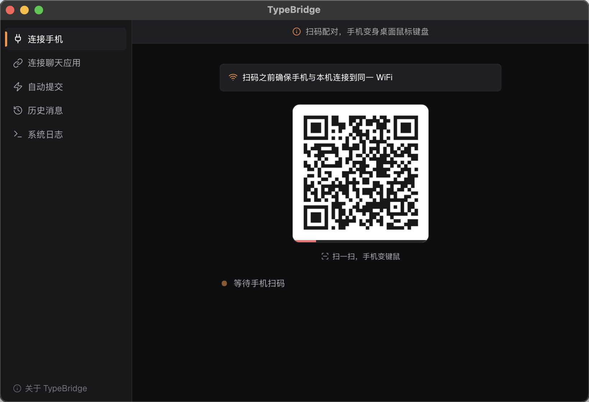
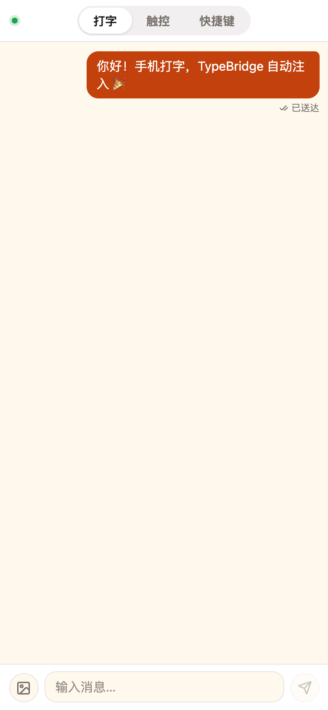
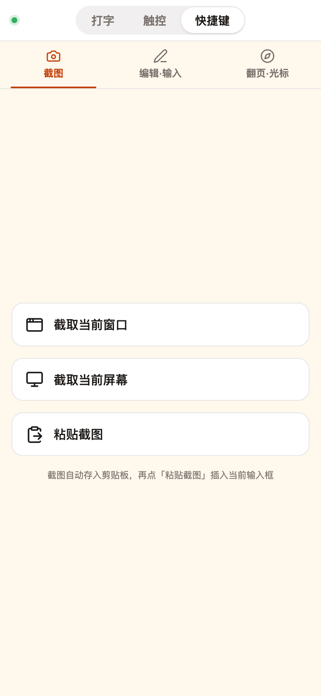

# 一部手机，就是你的下一套键鼠

> 打开 App，扫个码。手机立刻变成 Mac 的无线键盘和触控板。

---

你有没有过这种时候——

演示 PPT 时想遥控翻页，人却得跑回电脑前。窝沙发里刷网页，想搜点什么又懒得够键盘。对着 AI 写代码，手机和电脑之间来回传文字，复制粘贴到手酸。

这些琐碎的断点，TypeBridge 想帮你抹掉。

---

## TypeBridge 是什么？

TypeBridge 是一个 macOS 桌面应用。一句话：**把你的 iPhone 或安卓手机，变成 Mac 的无线键盘、触控板和语音输入器。**

不用蓝牙配对，不用同一个 Apple ID，数据线也不用。打开 App、手机扫个码，连上了。

*▲ 图1 | TypeBridge 桌面端主界面（WebChat 连接 Tab，扫码即可连接手机）*

你可以在手机上打字，文字出现在 Mac 光标所在的位置。也可以把手机屏幕当触控板，单指移鼠标、双指滚页面。还有一个更好用的——打开手机输入法自带的麦克风，说的话直接变成电脑上的文字。

---

## 三个模式，一部手机全搞定

### 打字模式

手机上敲字，点发送，文字就落在 Mac 光标的当前位置。VS Code、Terminal、浏览器地址栏、Slack 聊天框——光标在哪，字就落在哪。

打字模式天然支持语音输入：打开手机输入法（系统自带就行），点一下麦克风键，说出你想写的话，说完点发送。文字直接出现在 Mac 光标处。**不需要任何额外的语音识别引擎。** 中文随随便便上 200 字/分钟，比敲键盘快一倍。

> 手机收到验证码，不用念出来再敲——点发送，电脑输入框就填好了。写周报的时候，想到什么说什么，Notion 里一行行往外冒字。

### 触控板模式

手机屏幕变成 Mac 的触控板。单指移动光标，双指滚动页面。轻点是左键，双指轻点是右键。

> 站在投影前讲 PPT，手机在手里就能翻页、挪光标。窝沙发里刷 B 站，手机就是遥控器。

### 快捷键模式

第三个 Tab 是快捷键面板。截屏、撤销、全选、复制粘贴、方向键、翻页——常用操作都在里面，点一下，Mac 直接执行，手不用碰键盘。

> 给 AI 派活的时候，开口描述需求，手机说完，Cursor 那边就收到了。评审文档时，一手拿手机翻页，一手端咖啡。

---

## 手机说话，电脑出字

这是我个人觉得最爽的场景。

你在 TypeBridge 的 WebChat 打字页面里，点一下手机输入法的麦克风，说："帮我写一篇关于用户增长的分析报告，重点包括……"

说完点发送。你的 Mac 上，不管正在用哪个应用——ChatGPT 网页、Cursor 编辑器、飞书文档——光标在哪，文字就往哪落。

*▲ 图2 | 手机端 WebChat 聊天页面（打字模式，展示消息发送与注入状态）*

**不依赖任何云端语音服务。** 整条链路是：手机输入法本地识别 → TypeBridge 局域网传输 → 剪贴板 + Cmd+V 注入桌面光标处。

同一个 WiFi 下，全程局域网，数据不出家门。

---

## 快捷键面板

「快捷键」Tab 里分了三个区：**截图**、**编辑·输入**、**翻页·光标**。

截图——在手机上点「截图」Tab，选整屏或当前窗口，Mac 即刻完成截图。全选、复制、粘贴、撤销、重做——编辑文档一气呵成。方向键、Home/End、翻页——翻代码看文档，手不用碰键盘。

*▲ 图3 | 手机端 WebChat「快捷键」Tab（截图 / 编辑·输入 / 翻页·光标 三个分类）*

> 说白了，就是把键盘上你最常用的那十几个快捷键，搬到了手机上。

---

## 也支持 IM 机器人

如果你在用飞书、钉钉或企业微信，TypeBridge 也能接入它们的机器人。

在桌面端配置好自建应用，给 bot 发消息，消息就会自动注入到当前桌面光标所在的输入框。多条消息按顺序处理，不会打架。

> 团队里的用法：在群里 @机器人 发一段话，会议室大屏上的文档就同步更新了。

---

## 怎么开始？

1. 从 [typebridge.parksben.xyz](https://typebridge.parksben.xyz) 下载 macOS 版
2. 首次启动按提示授予「辅助功能」权限（一次就好）
3. 启动 WebChat 会话，手机扫码就连上
4. 选打字、触控或语音模式——开用

完全免费。不需要注册账号。甚至不需要外网——WebChat 走的是你家的 WiFi 局域网。

---

## 写在最后

TypeBridge 做的事不复杂：**让手机和 Mac 之间的那堵墙，消失。**

它不想取代你的键盘和触控板。只是在你想靠着椅背、窝在沙发里、站在讲台前的时候——让手机临时顶一会儿。

一部手机，就是你的下一套键鼠。

---

[下载 TypeBridge](https://typebridge.parksben.xyz/#download) · [GitHub](https://github.com/parksben/type-bridge)
