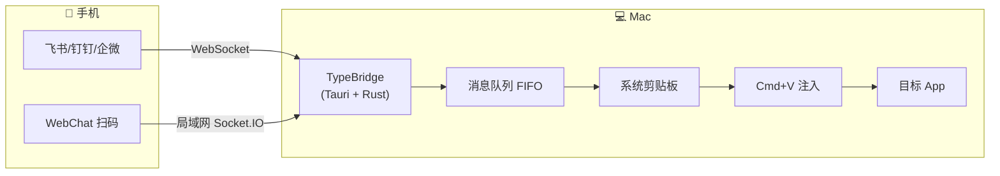

# 把手机变成 Mac 的无线键盘：TypeBridge 诞生记

> 手机说完话，Mac 光标处自动出现文字。这不是魔法，是一个 macOS 菜单栏小工具。

---

## 这玩意儿从哪冒出来的？

先说说我自己的日常——

每天我最频繁的操作不是写代码，而是在各种输入框之间切来切去。浏览器搜索栏、Obsidian 笔记、VSCode 编辑器、飞书/钉钉聊天框、终端命令行……有时候手机来了一条灵感，想记到电脑上，流程是这样的：

> 解锁手机 → 打开飞书 → 文件传输助手 → 粘贴 → 发送 → 电脑端收到 → 选中 → 复制 → 切到目标窗口 → 粘贴。

七步。就为了把一句话从手机搬到电脑上。

更别提语音转文字这个场景了。Mac 自带的听写功能我也用过，但总有种"和电脑说话"的别扭感。手机就不一样——按住说话、松手发送，这种交互已经刻进肌肉记忆了。

于是我开始想：**能不能在手机上发一条消息，Mac 自动帮我输入到当前光标位置？**

这就是 TypeBridge 的起点。

---

## 不是另一个剪贴板同步工具

市面上有不少"跨设备剪贴板同步"方案，Apple 生态自己就有一套。但它们的共同问题是：**只知道"把内容搬过来"，不知道"搬到哪"。**

TypeBridge 的核心思路完全不同：

- 你不需要先复制再粘贴。
- 你甚至不需要碰 Mac 的键盘和鼠标。
- 你在手机上说完一句话，Mac 当前正在编辑的那个输入框，自动就有了这段文字。

想象一下这些场景：

| 场景 | 以前 | 现在 |
|------|------|------|
| 开车想到一个 bug 修复方案 | 到了公司就忘了 | 对着手机说完，到工位时那段话已经在 VSCode 光标处等着你了 |
| 通勤路上看到一句好文案 | 截图 → 到家打开 → 对着敲 | 语音转文字发 bot → 到家 Obsidian 里已经有了 |
| 用 AI 对话工具时不想打字 | 切到微信，转文字，复制，切回来，粘贴 | 直接在飞书 bot 里说，自动进入 AI 对话框 |
| 多人在群里讨论，想看某句话 | 翻半天聊天记录 | WebChat 发一条，立刻出现在 Mac 前端 |

**手机是无线麦克风，Mac 是输出终端。**

---

## 怎么做到的：命令行气质，图形界面体验

TypeBridge 不是那种大而全的"效率平台"，它很克制——**一个菜单栏图标、一个配置窗口，搞定一切**。

### 架构一瞥



核心链路说的是：**IM 消息 → Rust 后端 → 剪贴板 → Cmd+V → 目标应用**。

这里的每个字都是精心考虑过的：

#### 为什么是剪贴板 + Cmd+V，而不是直接调 macOS 的 AX API 往里写？

一开始我们确实试过用 `AXUIElement` + `CGEventPost` 逐字符模拟键盘输入，看起来更"干净"。但实际一测就翻车：

- VSCode 这类 Electron 应用，AX API 查询焦点元素动不动就返回 `AXError.NoValue`、`AXError.CannotComplete`，消息丢了一半。
- 就算查到了焦点，某些富文本编辑器（比如 Notion 网页版、飞书文档）的内部 DOM 根本不暴露给 AX 树，`AXSetValue` 写进去，`onChange` 事件不触发，文档内容看上去变了实则没有保存。

剪贴板 + Cmd+V 方案虽然"简单粗暴"，但它不依赖目标应用的 AX 结构，只要这个应用支持粘贴（几乎所有 macOS 应用都支持），消息就能落地。

**在兼容性和优雅之间，我们选了兼容性。**

#### 为什么是 FIFO 队列，而不是收到就立刻注入？

因为 TypeBridge 支持四个渠道同时接入（飞书、钉钉、企业微信、WebChat）。如果你在飞书里发一条"修复上次那个空指针"，又在 WebChat 里发了一张截图——同时到，怎么处理？

队列的作用就是**串行化**：先到先处理，一条粘完再粘下一条，不会出现"文字和图片交错粘贴"的混乱。

#### Go sidecar 是怎么来的？

飞书、钉钉、企微的 SDK 官方主要提供 Go 和 Java 版本。选 Go 的理由直截了当：编译出来是一个静态二进制，可以直接打进 Tauri 的 `.app` 包里。不需要用户装任何运行时。

Go 进程负责 IM 协议的全部脏活——WebSocket 长连接、token 刷新、自动重连、消息格式解析。做完之后往 stdout 输出一行 JSON，Rust 侧消费。

```
飞书服务器 ←─WebSocket─→ feishu-bridge (Go) ──stdout JSON Lines──→ Tauri Core (Rust)
```

这种"sidecar 模式"的好处是：IM 协议升级时只需要改 Go 代码重新编译，Rust 和前端完全无感。

---

## 上手只需要两步

> 插一句：这里本来应该有张截图，后面补上。
> *[截图占位：应用首次启动的配置窗口]*

### 第一步：授权辅助功能权限

启动 App 后，会弹出一个礼貌但坚定的授权引导：

*[截图占位：辅助功能权限授权引导模态框]*

TypeBridge 需要辅助功能权限的唯一原因：**向前台应用发送 Cmd+V 和 Enter 按键**。不会读取屏幕、不会监控输入——它需要按"粘贴"这个权限。

一旦你在系统设置里打完勾，窗口自动消失，不需要重启应用。这里有一个小细节：我们会每 3 秒轮询一次权限状态，所以打完勾几乎即时生效。

### 第二步：连一个渠道

**WebChat**（零配置，最快上手）：
1. 点一下「连接 TypeBridge」→「WebChat」→「启动会话」
2. 手机扫码，输入桌面显示的 OTP 验证码
3. 连上了，发消息试试

*[截图占位：WebChat 连接成功后的桌面端界面 + 手机端聊天框]*

**IM 机器人**（适合已经在用飞书/钉钉/企微的团队）：
- 填 App ID + App Secret → 启动长连接 → 点「测试连接」做一键诊断
- 全部通过后，手机上给机器人发消息，Mac 上就会有反应

*[截图占位：飞书频道长连接已连接状态 + scope 检查清单全绿]*

---

## 来点"上分"的细节

一个产品的好坏，不在核心功能多强——而在那些"感觉被照顾到了"的瞬间。

### 自动提交：不仅是粘贴

消息粘到输入框后，如果你在聊天窗口或者 AI 对话框里，还得自己按一下 Enter 才能发出去。TypeBridge 默认帮你按了：

1. 消息粘贴完成
2. 自动模拟按下 Enter
3. 聊天消息发出、AI 开始回复、终端命令执行

提交按键可以自定义。比如有些 AI 工具（像 ChatGPT 网页版）喜欢用 `⌘ + Enter` 换行、`Enter` 提交，你可以配成 `Enter`。而飞书文档里 `Enter` 是换行、`⌘ + Enter` 是提交，你就配 `⌘ + Enter`。

**一个设置项，适配所有习惯。**

### 图片也能传

飞书里发一张截图给机器人，Mac 上自动粘贴到你当前编辑的位置。原理是一样的：

1. Go sidecar 通过飞书 API 下载原始图片字节
2. Rust 侧把图片写入系统剪贴板（`NSPasteboardTypePNG`）
3. 模拟 Cmd+V

图文混合消息也有保障：先粘文字，再粘图片，顺序不乱。

### 历史消息：不只是日志

所有消息都有记录，带着时间、来源（哪个渠道）、处理状态。告诉你这条消息有没有成功注入——以及如果失败了，原因是什么。

失败原因分成两个维度展示：
- **本地输入失败**（橙色）：辅助功能没开、前台恰好是 TypeBridge 自己、剪贴板出问题了
- **IM 反馈失败**（红色）：机器人在 IM 里想给你发个表情反馈，但 scope 权限不够

这两个问题可能同时出现，互不阻塞。消息可能已经成功注入，只是你没在 IM 里看到机器人的"确认表情"——分开展示让你知道问题出在哪一环节，而不是给你一个笼统的"发送失败"。

### 托盘即应用

TypeBridge 没有复杂的托盘菜单。点一下托盘图标，窗口弹出来；再点一下，窗口没了。跟微信桌面版一样的体验。

关闭窗口 ≠ 退出应用。进程继续在后台跑，收到消息照常处理。只有 Cmd+Q 或 Dock 右键退出才真正关掉。

---

## 技术栈：小身材大味道

TypeBridge 的体积不到 15MB，但背后是一套有意思的技术组合：

| 层 | 技术 | 角色 |
|----|------|------|
| IM 协议层 | Go | 编译成静态二进制，负责 WebSocket 长连接、API 调用 |
| 核心逻辑层 | Rust (Tauri) | 进程调度、消息队列、系统交互（剪贴板/按键模拟） |
| 用户界面层 | React + TypeScript + Tailwind CSS | 配置窗口、历史记录、日志 |
| WebChat 服务 | Rust (axum + socketioxide) | 嵌入式 HTTP + Socket.IO server |
| 移动端 WebChat | Vite + React + socket.io-client | 手机浏览器里的聊天界面 |

几个有意思的选择：

**Tauri 而不是 Electron**。同样写前端用 React，Tauri 的内存占用只有 Electron 的零头（因为用系统 WebView 而不是打包一个 Chromium）。TypeBridge 常驻后台，内存控制是个硬指标。

**多进程而不是单进程**。Go sidecar 和 Rust 主进程是独立的。Go 负责 IM 协议的脏活，Rust 负责系统交互。两者通过 stdout JSON Lines 通信——协议简单、调试方便、崩溃隔离（Go 挂了不影响 Rust 主进程，Rust 负责自动重拉）。

**自建局域网服务器**。WebChat 不走任何云服务。桌面端启动一个嵌入式 `axum` HTTP 服务器，绑 LAN IP，手机浏览器扫码直连。消息在局域网内流转，不到外网。断网也能用。

---

## 不吹不黑：谁适合用它

### 非常推荐

- **AI Coding 重度用户**：GitHub Copilot Chat / Cursor / Claude 对话框里，大概 30% 的交互是自然语言描述需求。用语音说完，比打字快三倍。
- **多设备文字工作者**：灵感稍纵即逝，手机上说完即可，不用切上下文。
- **团队协作场景**：有人在 IM 群里 @ 你了某句话，直接转给机器人，桌面上立刻可用。
- **不想在手机上敲长篇的人**：手机语音转文字的质量已经相当好了，TypeBridge 替你省掉搬运。

### 不太适合

- **手机和电脑不在同一个网络**：暂时不支持公网直连（安全考量）。
- **Windows 用户**：目前只支持 macOS。Tauri 本身跨平台，但注入逻辑用的是 macOS 专属 API，移植需要重新实现。
- **对隐私极度敏感的线下场景**：WebChat 方案不带端到端加密，局域网内理论上可以被 MITM（虽然概率很低）。

---

## 开源与社区

TypeBridge 目前是私有仓库，有计划在稳定后开源。你可以先通过官网下载 `.dmg` 包体验：

> [typebridge.parksben.xyz](https://typebridge.parksben.xyz)

也可以直接在 GitHub Release 页下载各版本：

> [GitHub Releases](https://github.com/parksben/typebridge/releases)

欢迎通过 Issue 提需求和 bug，也可以直接联系作者。

---

## 写在最后

TypeBridge 做的事情非常小，代码量也不算大——三个 Go 模块加一个 Rust 核心加一套 React UI。但我觉得它解决了一个真实存在的摩擦力：

**在手机和电脑之间搬运文字，这件事不应该是七步。**

一步就够了。

如果说键盘是手的延伸，那 TypeBridge 希望做的是——

**让手机变成键盘的另一半。**

---

*— Parksben, 2026 年 5 月*

*[等截完图，我会把这篇文同步到掘金、V2EX、少数派等社区。如果觉得有意思，欢迎扩散。]*
