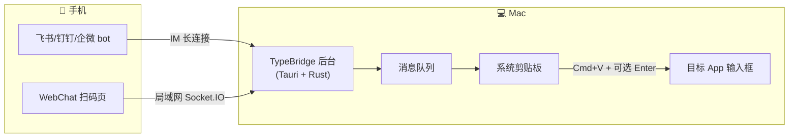

# 🎹 把手机变成 Mac 的无线键盘：TypeBridge 诞生记

> 手机说完话，Mac 光标处自动出现文字。这不是魔法，是一个 macOS 菜单栏小工具。

*[配图建议：一张 TypeBridge 的 Logo + 产品概念图，手机→桥→Mac，参考官网 Hero Banner]*

---

## 🤔 灵感从哪来：把每一件小事做到极致

先讲一个你大概率经历过的瞬间——

你坐在电脑前写周报，飞书文档开着，光标在闪。突然想用手机语音转一段话，因为说话比打字快。你说完，手机里出现了那段文字，然后你开始做一件全世界程序员都在做的事：

> 复制 → 发到文件传输助手 → 切回电脑 → 选中 → 复制 → 切回文档 → 粘贴。

七步。每一次都是。

更微妙的是**打断感**。手指刚从键盘挪到手机上，思路已经飘了一半。再做一轮搬运操作，回到电脑前，刚才想好的下一句话已经模模糊糊了。

这就是 TypeBridge 要干掉的东西——**不是某个大问题，而是一个每天发生十几次的微小摩擦力。**

![梗图占位：一张经典的 "This is fine" 梗图，上方文字： "复制→发给自己→再复制→粘贴×10次/天"，狗坐在火里说 "This is fine."]

把这句话从七步缩到一步，会不会不一样？

---

## 💡 不是剪贴板同步，是"输入即到达"

市面上的跨设备剪贴板同步方案很多，Apple 生态自己就有一套 Universal Clipboard。但它们有个共同假设：**内容搬过来之后，还得你自己贴过去。**

TypeBridge 的想法是反过来的——它不管"内容在哪"，只管"输入到哪"：

- ✅ 你不需要先复制、再切窗口、再粘贴。
- ✅ 你甚至不需要碰 Mac 的键盘。
- ✅ 你在手机上说完一句话，Mac 当前那个正在闪烁的光标处，**自动就有了这段文字。**

区别很小，但体验完全不同。前者是"我帮你搬砖，你自己砌墙"，后者是"砖直接砌好了"。

*[配图建议：一张对比图，左侧是传统流程 "手机→复制→传输→电脑→选中→粘贴" 的六步线框图，右侧是 TypeBridge "手机→Mac光标" 的单箭头，视觉上突出"一步"感]*

---

## 🎯 五个让你"回不去"的真实场景

以下是 TypeBridge 设计之初就瞄准的五个典型场景。它们不大，但高频。

### 场景一：说话就是打字 🎤

> 写周报、回邮件、填表单——对着手机说完，文字直接在电脑光标处出现。

手机语音转文字的正确率已经非常高了，中文轻松 200+ 字/分钟，比大多数人的打字速度快一倍。问题是：转出来的文字还在手机上。TypeBridge 让它直接落在电脑上。

- 微信上有人找 → 手机说一句回复 → 电脑微信聊天框里直接有文字
- VSCode 写注释 → 手机口述注释内容 → 编辑器里实时落字
- 打开「自动提交」开关，说完话连回车都不用按

> 🎯 **一句话**：把嘴变成键盘。

---

### 场景二：给 AI 配一个声音遥控器 🤖

> 在 Cursor、Copilot Chat 里，用手机说出需求——AI 收到完整指令立刻执行。

AI Coding 时代，你和 AI 之间的交互 30% 是自然语言描述需求。打字描述"帮我重构这个函数，把回调改成 async/await，同时保持原有错误处理逻辑"——不如直接说出来。

- 手机说「给这段代码写单测」→ Cursor 对话栏收到指令 → AI 开始生成
- 重构时不想打断思路 → 手机口头描述变更 → AI 继续干活
- 开会时想到一个 bug → 手机发给 AI → 回来代码已修好

口头描述往往比打字更完整 —— 尤其是复杂的重构需求，说出来一气呵成，不用一边想一边敲。

> 🎯 **一句话**：给 AI 配一个声音遥控器。

---

### 场景三：写文档，边说边出稿 📝

> 写技术文档、会议纪要——对着手机边想边说，文字实时流进电脑编辑器。

写文档最痛苦的不是"写"，而是"坐下来开始写"。手机语音能降低这个心理门槛：随手拿起手机就开始说，不要求正襟危坐。

- 写周报 → 手机逐条口述本周做了什么 → Notion 里逐行出现
- 写技术文档 → 手机描述思路结构 → Markdown 编辑器实时生成段落
- 会议刚结束 → 趁记忆新鲜口述纪要 → 电脑上直接有草稿

说完就是初稿，不用事后一本正经地"整理"。

*[截图占位：一侧是手机语音转文字界面，另一侧是 Mac 上 Notion/飞书文档同步出现的文字]*

> 🎯 **一句话**：让文档以说话的速度产出。

---

### 场景四：跨设备粘贴，一步到位 🔗

> 手机上看到一段代码、一个网址、一个地址——发给机器人，电脑上直接出现。

这是最常见也最"解渴"的场景。手机浏览器里看到的网址，同事发来的 SQL 语句，需要填到系统里的快递地址……以前要"复制→发给自己→再复制→粘贴"，现在一步。

- 手机浏览器看到一个网址 → 发给机器人 → 电脑地址栏直接出现
- 手机收到一段 SQL → 转发给机器人 → 终端里 ctrl+v 一下即可
- 截图发给机器人 → 自动写入电脑剪贴板 → 任意位置粘贴

*[截图占位：手机端飞书对话界面，用户发了一条地址/代码给机器人；Mac 端对应输入框里已经出现相同内容]*

> 🎯 **一句话**：比 AirDrop 快，比微信文件传输更方便。

---

### 场景五：团队共享键盘 👥

> 群聊 @ 机器人发指令，所有在线成员的 Mac 同步收到。

运维在群里发部署命令，开发者终端里自动出现；测试贴一个测试环境的 IP，同事不用手敲。

- 运维发 `ssh deploy@10.0.1.5` → 同事终端直接出现
- 群里贴一段 JSON 配置 → 开发者编辑器里同步到位
- 发布前发「确认上线」→ 全队 Mac 同时弹出

> 🎯 **一句话**：一条消息，全队同步。

---

## 🏗️ 怎么做到的：架构极简，细节用心

TypeBridge 的体积不到 15MB。背后的技术思路是：**用最简单的路径，做最可靠的交付。**

整个链路就四步：**收到消息 → 入队 → 写剪贴板 → 粘贴到目标应用。**

这套方案的妙处在于：它不依赖目标应用的内部结构。不管你是 VSCode、Terminal、浏览器网页、Notion、Slack，只要这个应用支持粘贴（所有 macOS 应用都支持），消息就能进去。

我们试过更"优雅"的方案——通过 macOS 的 Accessibility API 逐字符注入键盘事件，像真人在打字一样。在 Electron 应用和富文本编辑器上频繁翻车之后，我们选择回到最简单的路上来。

**在优雅和可靠之间，选了可靠。**

*[配图建议：一张 "Reliable vs Elegant" 的二选一梗图，左边是优雅的机械表（标注 AX API），右边是 G-Shock（标注 Cut & Paste），圈在 G-Shock 上]*

### 多一个渠道，不增加复杂度

TypeBridge 同时支持飞书、钉钉、企业微信和内置 WebChat 四种接入方式。收到的所有消息进入同一个 FIFO 队列，依次处理——先到先粘，不抢不打架。

你可以在飞书里发一条文字，又在 WebChat 发一张截图，TypeBridge 会老老实实给你按顺序粘好。

### Go sidecar：把 IM 的脏活封印在一个独立进程里

IM SDK 的 WebSocket 长连接、token 刷新、断线重连——这些协议细节都装在 Go 编译的静态二进制里。Go 进程做完后往 stdout 输出一行 JSON，Rust 主进程消费。

好处很简单：IM 协议升级只改 Go 代码，Rust 和前端完全不受影响。

---

## 🚀 上手：两步，然后忘掉它

### 第一步：授权辅助功能权限

首次启动时，TypeBridge 会弹出一个引导页——

*[截图占位：辅助功能权限授权引导模态框]*

它需要一个权限：**模拟按下 Cmd+V 和 Enter**。仅此而已。不会读屏、不会监控输入、不需要网络代理。

在系统设置里打完勾，授权引导自动消失（我们每 3 秒检查一次状态，几乎即时生效）。

### 第二步：连一个渠道，选你喜欢的姿势

| 渠道 | 门槛 | 一句话 |
|------|------|--------|
| **WebChat** | 零配置 | 点「启动会话」→ 手机扫码 → 输入 OTP，完。最快 30 秒上手 |
| **飞书 / 钉钉 / 企微** | 需要一个自建应用 | 填 App ID + Secret → 启动 → 点「测试连接」一键诊断 |

*[截图占位：WebChat 连接成功的桌面端界面 + 手机端聊天界面，显示一条文字消息已成功发送]*

连上之后，TypeBridge 退到菜单栏，静静待命。你只管在手机上发消息，剩下的全自动。

> 💡 **小技巧**：关闭窗口 ≠ 退出。TypeBridge 在后台持续运营，Cmd+Q 才会真正关掉。

---

## ✨ 那些"感觉被照顾到了"的细节

### 自动提交：不止粘贴

消息粘到输入框后，再自动帮你按一下 Enter——在聊天窗口这就是"发出"，在 AI 对话框这就是"开始回复"，在终端这就是"执行命令"。

按键可以自定义。ChatGPT 网页版可能用 Enter 提交，飞书文档用 `⌘ + Enter` 提交——一个设置项搞定所有差异。

### 图片也能传

手机发一张截图给机器人，Mac 上直接粘贴到你正在编辑的位置。图文混合消息也保持原始顺序：先粘文字，再粘图片。

### 失败原因，分开说

如果一条消息注入失败，TypeBridge 不会给你一个笼统的"发送失败"，而是分两层展示：

- 🔶 **本地输入失败**：辅助功能没开？前台恰好是 TypeBridge 自己？
- 🔴 **IM 反馈失败**：机器人想发确认表情但 scope 权限不够？

两个问题互不阻塞，分开显示。你一眼就知道问题出在哪个环节。

---

## 🧰 技术栈一览

| 层 | 技术 | 角色 |
|----|------|------|
| IM 协议层 | Go | 静态二进制，负责 WebSocket 长连接与 API 调用 |
| 核心逻辑层 | Rust (Tauri) | 进程调度、消息队列、系统交互 |
| 用户界面层 | React + TypeScript + Tailwind CSS | 配置窗口、历史记录 |
| WebChat 服务 | Rust (axum + socketioxide) | 嵌入式 HTTP + Socket.IO |
| 移动端 WebChat | Vite + React + socket.io-client | 手机浏览器里的聊天界面 |

选 Tauri 不选 Electron，因为常驻后台的应用内存控制是硬指标；用系统 WebView 而不是打包 Chromium，省下的内存是实打实的。

WebChat 自建局域网服务器，消息不经过任何云服务，断网也能用。

---

## ✅ 谁适合，谁不适合

### 适合你，如果你——

- 🔹 用 AI Coding 工具（Cursor / Copilot Chat / Claude），经常用自然语言描述需求
- 🔹 写文档/周报/纪要频率高，想用语音加速产出
- 🔹 手机和电脑之间频繁搬运文字，烦了
- 🔹 团队里有共享命令 / 配置 / 地址的需求

### 暂时不太适合，如果你——

- 🔸 只用 Windows（TypeBridge 目前是 macOS 专属，注入逻辑依赖 macOS Accessibility API）
- 🔸 对局域网传输有极高安全要求（WebChat 渠道不带端到端加密；飞书/钉钉/企微渠道走的是 IM 官方加密通道，安全性取决于平台本身）

> ⚠️ **关于网络**：一个常见的误解是"必须在同一 WiFi 下才能用"。这只对 **WebChat 渠道**成立。飞书、钉钉、企业微信走的是 IM 公有云长连接，**手机和电脑在任何网络下都能通**——一个在 4G、一个在办公室 WiFi，完全没问题。

---

## 🌐 下载与反馈

> 📦 官网下载：[typebridge.parksben.xyz](https://typebridge.parksben.xyz)
>
> 🐙 GitHub Releases：[github.com/parksben/typebridge/releases](https://github.com/parksben/typebridge/releases)
>
> 🐛 遇到 bug 或有想法？欢迎提 Issue，也可以直接联系作者。

---

## 💬 写在最后

TypeBridge 做的事情很小，代码量也不算大——三个 Go 模块 + 一个 Rust 核心 + 一套 React UI。但每次用它的时候，我都会想起一句话：

> "好工具不是让你感觉自己在用工具，而是让你忘了这个步骤的存在。"

把一段文字从手机搬到电脑——这件事不值得七步。

一步就好。

**让手机成为键盘的另一半。** 🎹

---

*— Parksben, 2026 年 5 月*

*[本文会同步发布到掘金、V2EX、少数派等技术社区。觉得有意思的话，欢迎转发扩散。]*
